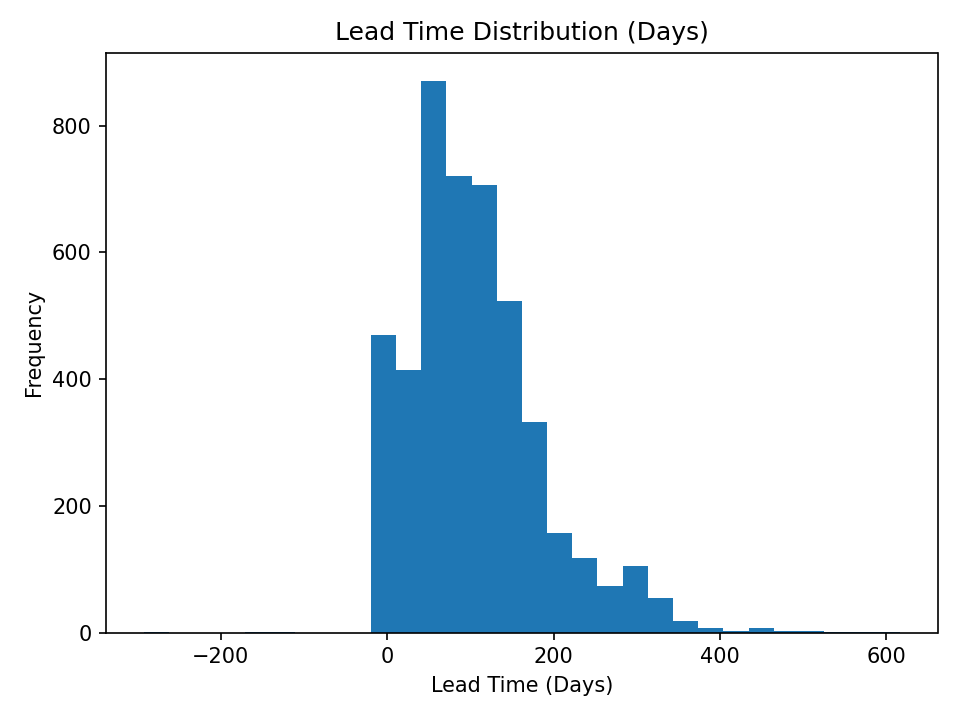
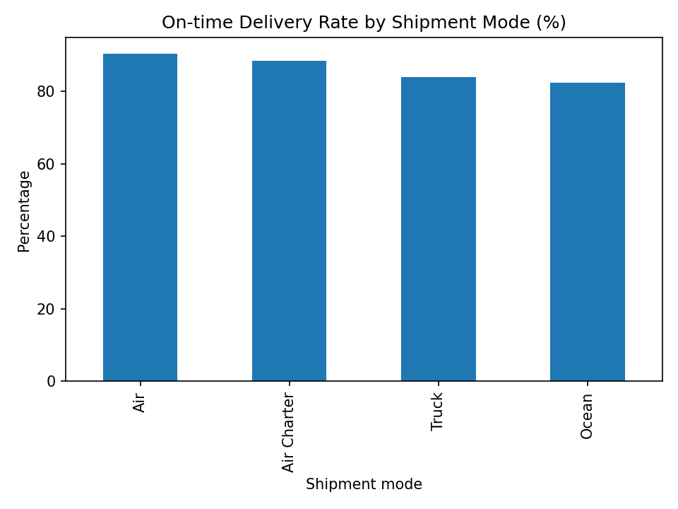
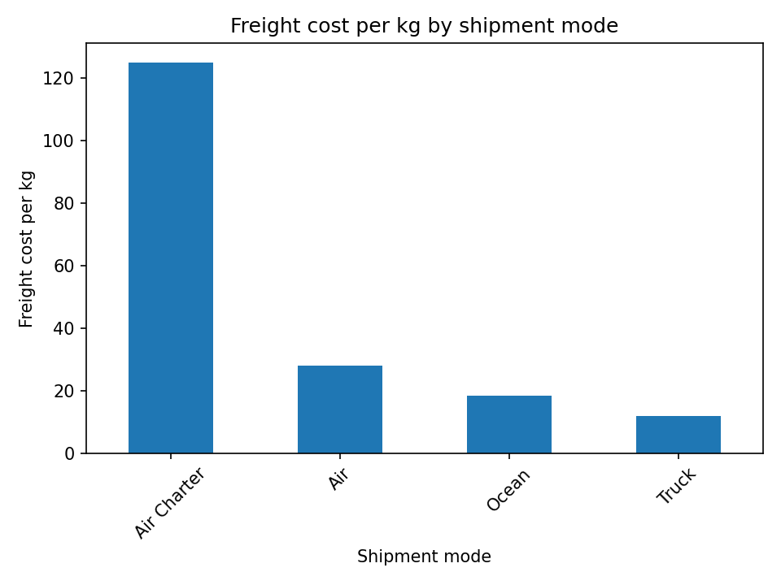
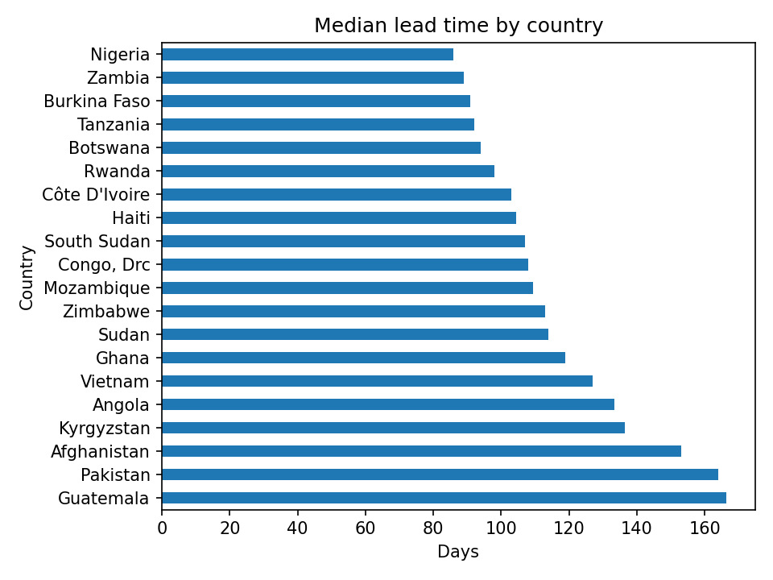

# 🚚 Supply Chain Performance & Freight Cost Analysis

## 1. Project Context

This project analyzes historical supply chain and logistics data to evaluate delivery reliability and freight cost efficiency across different shipment modes, countries, and time periods.

**Business problem:**

Logistics teams need to balance timely delivery with transportation cost efficiency, particularly in global supply chains where lead times and freight costs vary significantly by region and shipment mode.

The analysis is designed as a decision-support project, similar to what a Data Analyst or Operations Analyst would deliver to logistics managers or supply chain stakeholders.

## 2. Dataset Overview

The dataset contains shipment-level logistics records, including:

- Purchase order and delivery timelines
- Shipment mode and fulfillment method
- Shipment weight and freight cost
- Country-level delivery information

Raw data was sourced from a public supply chain dataset and cleaned, standardized, and validated before analysis.

## 3. Business Questions

- How reliable is delivery performance across shipments?
- How consistent are lead times across countries and shipment modes?
- Which shipment modes drive higher freight cost efficiency?
- What trade-offs exist between delivery reliability and freight cost?
- Are there specific regions or shipment modes that represent operational bottlenecks?

## 4. Key Findings & Insights
### 4.1 Delivery reliability is generally strong, but lead time variability remains high

- Approximately 89% of shipments are delivered on time.
- However, lead time distribution shows substantial dispersion.
- The median lead time is around three months, with a wide interquartile range, indicating inconsistent delivery durations.

**Insight:**

On-time delivery performance alone does not guarantee predictable logistics operations. Improving lead time consistency may be as important as improving delivery speed.

### 4.2 Shipment mode is the primary driver of cost efficiency

- Air shipments incur the highest freight cost per kilogram.
- Truck and ocean shipments provide significantly better cost efficiency.
- Air Charter shipments show high cost variability, likely driven by consolidation size and routing.

**Insight:**

Shipment mode selection represents the strongest lever for balancing cost efficiency and delivery urgency.

### 4.3 Clear trade-off between delivery reliability and freight cost

- Higher-cost shipment modes generally achieve better on-time performance.
- Lower-cost modes are used selectively, likely when delivery urgency is lower.

**Insight:**

The logistics network prioritizes delivery reliability over cost minimization, which aligns with the mission-critical nature of the shipments.

### 4.4 Geographic differences reveal structural constraints

- Median lead time varies significantly by country.
- Some destinations consistently experience longer delivery cycles.

**Insight:**

Country-level performance differences likely reflect infrastructure, customs complexity, and regional logistics capacity rather than execution issues alone.

## 5. Recommendations

**1. Align shipment mode selection with procurement urgency**
    Reduce over-reliance on air freight for purchase orders with flexible delivery timelines. Procurement plans should explicitly distinguish between time-critical and non-critical orders to avoid unnecessary premium freight costs.

**2. Leverage trucking for regional and replenishment shipments**
    Expand the use of truck transportation for regional deliveries and routine replenishment orders where lead time tolerance is higher. This can provide immediate cost control without compromising service levels.

**3. Restrict Air Charter usage to exceptional cases**
    Limit air charter shipments to urgent or high-risk scenarios where standard air freight cannot meet delivery requirements. Air charter should be treated as a contingency option rather than a default mode.

**4. Increase ocean freight utilization for bulk and low-priority orders**
    For large-volume or low-priority procurement, ocean freight should be planned earlier in the production and procurement cycle to take advantage of its cost efficiency while managing longer lead times.

**5. Incorporate lead time variability into supplier and production planning**
    Review vendors and regions with consistently long or highly variable lead times. Production schedules and safety stock levels should account for this variability to reduce downstream delivery pressure and last-minute freight escalation.

## 6. Skills & Tools

- Python (pandas, matplotlib)
- Data cleaning and validation
- Exploratory data analysis
- KPI design and performance analysis
- Business-focused analytical storytelling

## Author
**Trinh Nguyen**  

📧 Contact: ng.trinh3023@gmail.com

📍 GitHub: [https://trinhnguyen-venus.github.io/](https://trinhnguyen-venus.github.io/)